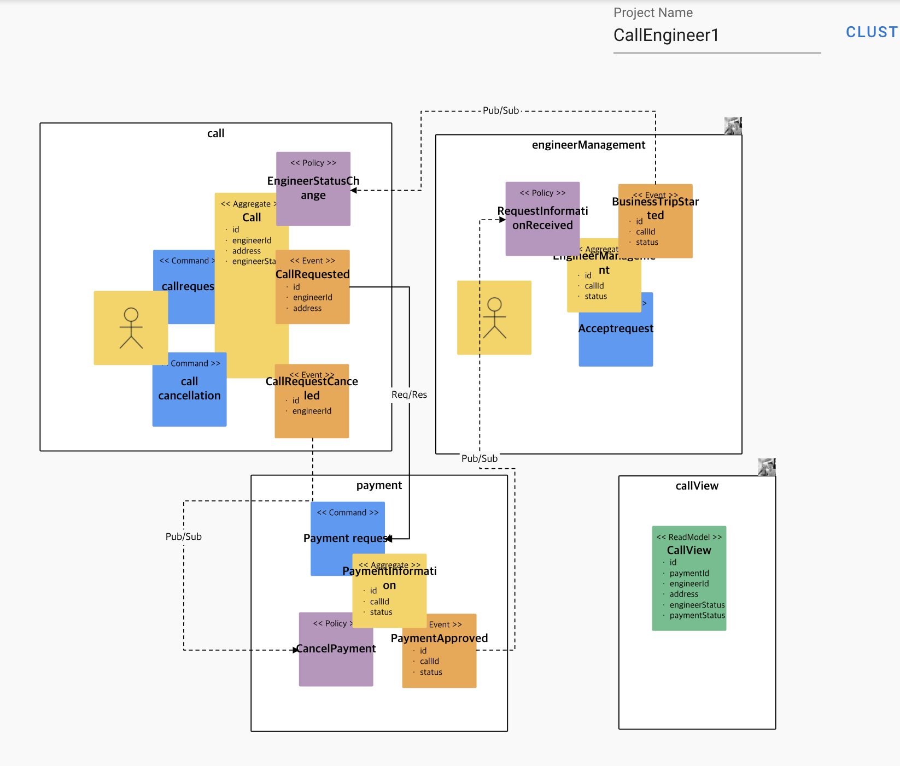
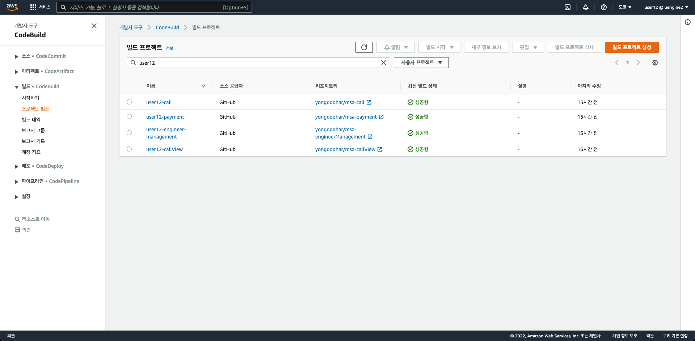
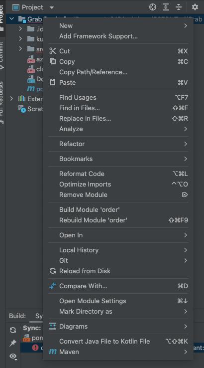
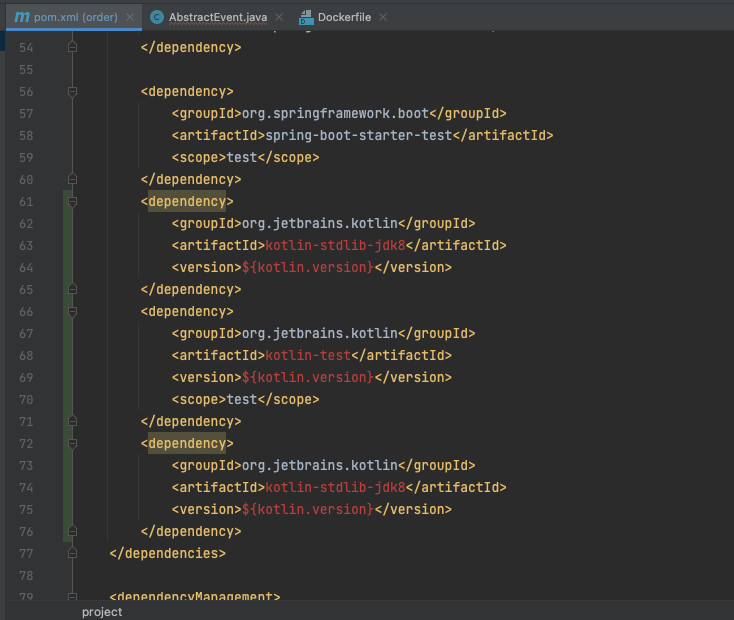

가전제품 as콜
============

# 평가항목
  * 분석설계
  * SAGA
  * CQRS
  * Req / Resp
  * Gateway
  * Deploy / Pipeline
  * Circuit Breaker
  * Config Map / Persustemce Volume
  * Autoscale(HPA)
  * Self-healing(Liveness Probe)
  * Zero-downtime deploy(Readiness Probe)
  * Polyglot
   
----


# 분석설계
## *기초적인 이벤트 도출이나, Aggregation 작업은 `Bounded Context`를 먼저 선정하고 pub/sub연결*


- 기능요소
  - 사용자가 엔지니어콜을 `요청` (OK)
  - 사용자가 `결제` (OK)
  - 결제가 완료되면 택시기사에게 `엔지니어콜 요청정보 전달` (OK)
  - `엔지니어가 콜을 확정`하면 출장이 시작되고 `엔지니어콜 요청상태 변경` (OK)


# SAGA & CQRS & Req / Resp
## 서비스를 Local에서 아래와 같은 방법으로 서비스별로 개별적으로 실행한다.
## 3개의 도메인으로 관리되고 있으며 `엔지니어콜(call)`, `결제(payment)`, `엔지니어관리(engineermanagement)`으로 구성됨
```
cd call
mvn spring-boot:run
```
```
cd engineermanagement
mvn spring-boot:run 
```
```
cd payment
mvn spring-boot:run  
```


 
```diff
    
    @Entity
    @Table(name = "Call_table")
    public class Call  {

        @Id
        @GeneratedValue(strategy = GenerationType.AUTO)
        private Long id;
        private Long engineerId;
        private String address;
        private String engineerStatus;

        @PostPersist
        public void onPostPersist(){
            CallRequested callRequested = new CallRequested();
            BeanUtils.copyProperties(this, callRequested);
            callRequested.publishAfterCommit();

            callengineer.external.PaymentInformation paymentInformation = new callengineer.external.PaymentInformation();

            paymentInformation.setCallId(this.getId());
            paymentInformation.setStatus("1");

            CallApplication.applicationContext.getBean(callengineer.external.PaymentInformationService.class)
                .paymentRequest(paymentInformation);

          }
```
   
+ 서비스 호출흐름(Sync)<p>
`배차요청(Call)` -> `결제(Payment)`간 호출은 동기식으로 일관성을 유지하는 트랜젝션으로 처리
* 고객이 목적지를 설정하고 택시 배차를 요청한다.
* 결제서비스를 호출하기위해 FeinClient를 이용하여 인터페이스(Proxy)를 구현한다.
* 배차요청을 받은 직후(`@PostPersist`) 결제를 요청하도록 처리한다.
```
// PaymentInformationService.java

    package callengineer.external;

    import ...

    // @FeignClient(name="payment", url="http://user12-payment:8080")
    @FeignClient(name="payment", url="http://localhost:8083")
    public interface PaymentInformationService {
        @RequestMapping(method= RequestMethod.GET, path="/paymentInformations")
        public void paymentRequest(@RequestBody PaymentInformation paymentInformation);

    }

```
   
+ 서비스 호출흐름(Async)<p>
* 결제가 완료되면 엔지니어 할당시 엔지니어콜요청내용을 엔지니어에게 전달하는 행위는 비동기식으로 처리되, `엔지니어할당 상태의 변경이 블로킹 되지 않도록 처리`
* 이를 위해 결제과정에서 기록을 남기고 승인정보를 `Kafka`로 전달한다.
   
```diff
package callengineer;

@Entity
@Table(name="PaymentInformation_table")
public class PaymentInformation {

...
    @PrePersist
    public void onPrePersist(){
     	PaymentApproved paymentApproved = new PaymentApproved();
        BeanUtils.copyProperties(this, paymentApproved);
        paymentApproved.publishAfterCommit();
    }
}

```

* 엔지니어관리(Allocation)에서는 결제 승인 Event를 수신해 PolicyHandler에서 후행 작업을 처리한다.
* 엔지니어는 수신된 정보를 수락하고 고객에게 이동한다.

```java
package callengineer;

@Service
public class PolicyHandler{
    @StreamListener(KafkaProcessor.INPUT)
    public void wheneverPaymentApproved_RequestInformationReceived(@Payload PaymentApproved paymentApproved){

        if(!paymentApproved.validate()) return;

        System.out.println("\n\n##### listener RequestInformationReceived : " + paymentApproved.toJson() + "\n\n");
  
  }   
```

+ 엔지니어에 대한 할당 요청

```sql
http http://localhost:8081/calls engineerId=3 address="seoul" engineerStatus=0
```

```sql
HTTP/1.1 201 
Content-Type: application/json;charset=UTF-8
Date: Fri, 08 Apr 2022 04:31:59 GMT
Location: http://localhost:8081/calls/1
Transfer-Encoding: chunked

{
    "_links": {
        "call": {
            "href": "http://localhost:8081/calls/1"
        },
        "self": {
            "href": "http://localhost:8081/calls/1"
        }
    },
    "address": "seoul",
    "engineerId": 3,
    "engineerStatus": "0"
}
```

+ 카프카 consumer 이벤트 모니터링

```
docker exec -it kafkadocker_kafka_1 /bin/sh
/opt/kafka_2.13-2.8.1/bin/kafka-console-consumer.sh --bootstrap-server localhost:9092 --topic callengineer --from-beginning
```

```sql
{"eventType":"CallRequested","timestamp":1649395103963,"id":3,"engineerId":1,"address":"seoul","me":true}
{"eventType":"PaymentApproved","timestamp":1649395199928,"id":1,"callId":4,"status":"1"}
```

+ callView 서비스를 실행

+ grabView의 Query Model을 통해 CallRequested와 PaymentApproved상태를 `통합조회`

- Query Model 은 발생한 모든 이벤트를 수신하여 자신만의 `View`로 데이터를 통합 조회 가능하게 함

```
http http://localhost:8084/callViews
```

```sql
HTTP/1.1 200 
Content-Type: application/hal+json;charset=UTF-8
Date: Fri, 08 Apr 2022 05:25:28 GMT
Transfer-Encoding: chunked

{
    "_embedded": {
        "callViews": [
            {
                "_links": {
                    "callView": {
                        "href": "http://localhost:8084/callViews/1"
                    },
                    "self": {
                        "href": "http://localhost:8084/callViews/1"
                    }
                },
                "address": "seoul",
                "engineerId": 1,
                "engineerStatus": null,
                "paymentId": 1,
                "paymentStatus": 1
            }
        ]
    },
    "_links": {
        "profile": {
            "href": "http://localhost:8084/profile/callViews"
        },
        "self": {
            "href": "http://localhost:8084/callViews"
        }
    }
}
```

## Gateway
+ gateway 및 virtualService 생성
```diff
apiVersion: "networking.istio.io/v1alpha3"
kind: "Gateway"
metadata: 
  name: callengineer
  namespace: istio-cb-ns
spec: 
  selector: 
    istio: "ingressgateway"
  servers: 
    - 
      port: 
        number: 80
        name: "http"
        protocol: "HTTP"
      hosts: 
        - "*"

---


apiVersion: networking.istio.io/v1alpha3
kind: VirtualService
metadata:
  name: vsvc-call
  namespace: istio-cb-ns
spec:
  gateways:
  - callengineer
  hosts:
  - "*"
  http:
  - name: primary       # referenced in canary.trafficRouting.istio.virtualService.routes
    match: 
    - uri: 
        prefix: "/calls"
    # rewrite:
    #   uri: "/"
    route:
    - destination:
        host: user12-call
    #     subset: stable  # referenced in canary.trafficRouting.istio.destinationRule.stableSubsetName
    #   weight: 100
    # - destination:
    #     host: call
    #     subset: canary  # referenced in canary.trafficRouting.istio.destinationRule.canarySubsetName
    #   weight: 0

---


# apiVersion: networking.istio.io/v1alpha3
# kind: DestinationRule
# metadata:
#   name: destrule-call
# spec:
#   host: call
#   subsets:
#   - name: canary   # referenced in canary.trafficRouting.istio.destinationRule.canarySubsetName
#     labels:        # labels will be injected with canary rollouts-pod-template-hash value
#       app: call
#   - name: stable   # referenced in canary.trafficRouting.istio.destinationRule.stableSubsetName
#     labels:        # labels will be injected with canary rollouts-pod-template-hash value
#       app: call

---


apiVersion: networking.istio.io/v1alpha3
kind: VirtualService
metadata:
  name: vsvc-engineer-management
  namespace: istio-cb-ns
spec:
  gateways:
  - callengineer
  hosts:
  - "*"
  http:
  - name: primary       # referenced in canary.trafficRouting.istio.virtualService.routes
    match: 
    - uri: 
        prefix: "/engineer-managements"
    # rewrite:
    #   uri: "/"
    route:
    - destination:
        host: user12-engineer-management
    #     subset: stable  # referenced in canary.trafficRouting.istio.destinationRule.stableSubsetName
    #   weight: 100
    # - destination:
    #     host: engineerManagement
    #     subset: canary  # referenced in canary.trafficRouting.istio.destinationRule.canarySubsetName
    #   weight: 0

---


# apiVersion: networking.istio.io/v1alpha3
# kind: DestinationRule
# metadata:
#   name: destrule-engineerManagement
# spec:
#   host: engineerManagement
#   subsets:
#   - name: canary   # referenced in canary.trafficRouting.istio.destinationRule.canarySubsetName
#     labels:        # labels will be injected with canary rollouts-pod-template-hash value
#       app: engineerManagement
#   - name: stable   # referenced in canary.trafficRouting.istio.destinationRule.stableSubsetName
#     labels:        # labels will be injected with canary rollouts-pod-template-hash value
#       app: engineerManagement

---


apiVersion: networking.istio.io/v1alpha3
kind: VirtualService
metadata:
  name: vsvc-payment
  namespace: istio-cb-ns
spec:
  gateways:
  - callengineer
  hosts:
  - "*"
  http:
  - name: primary       # referenced in canary.trafficRouting.istio.virtualService.routes
    match: 
    - uri: 
        prefix: "/paymentInformations"
    # rewrite:
    #   uri: "/"
    route:
    - destination:
        host: user12-payment

---


# apiVersion: networking.istio.io/v1alpha3
# kind: DestinationRule
# metadata:
#   name: destrule-payment
# spec:
#   host: payment
#   subsets:
#   - name: canary   # referenced in canary.trafficRouting.istio.destinationRule.canarySubsetName
#     labels:        # labels will be injected with canary rollouts-pod-template-hash value
#       app: payment
#   - name: stable   # referenced in canary.trafficRouting.istio.destinationRule.stableSubsetName
#     labels:        # labels will be injected with canary rollouts-pod-template-hash value
#       app: payment

---


apiVersion: networking.istio.io/v1alpha3
kind: VirtualService
metadata:
  name: vsvc-call-view
  namespace: istio-cb-ns
spec:
  gateways:
  - callengineer
  hosts:
  - "*"
  http:
  - name: primary       # referenced in canary.trafficRouting.istio.virtualService.routes
    match: 
    - uri: 
        prefix: "/call-views"
    # rewrite:
    #   uri: "/"
    route:
    - destination:
        host: user12-call-view
    #     subset: stable  # referenced in canary.trafficRouting.istio.destinationRule.stableSubsetName
    #   weight: 100
    # - destination:
    #     host: callView
    #     subset: canary  # referenced in canary.trafficRouting.istio.destinationRule.canarySubsetName
    #   weight: 0

---


# apiVersion: networking.istio.io/v1alpha3
# kind: DestinationRule
# metadata:
#   name: destrule-callView
# spec:
#   host: callView
#   subsets:
#   - name: canary   # referenced in canary.trafficRouting.istio.destinationRule.canarySubsetName
#     labels:        # labels will be injected with canary rollouts-pod-template-hash value
#       app: callView
#   - name: stable   # referenced in canary.trafficRouting.istio.destinationRule.stableSubsetName
#     labels:        # labels will be injected with canary rollouts-pod-template-hash value
#       app: callView


```
- 서비스 호출 및 VirtualService가 정상적으로 서비스 되고 있음을 확인
```diff
 kubectl -n istio-system get service/istio-ingressgateway
NAME                   TYPE           CLUSTER-IP      EXTERNAL-IP                                                                   PORT(S)                                                                      AGE
istio-ingressgateway   LoadBalancer   10.100.31.171   ae4609bc10f1f42998c584fe14ca135e-995907846.ap-northeast-1.elb.amazonaws.com   15021:31779/TCP,80:31137/TCP,443:31132/TCP,31400:32094/TCP,15443:31807/TCP   19m


 http http://a3872551417fb4951ac6b06618b250a5-1733633927.ap-northeast-1.elb.amazonaws.com/calls engineerId=1 address="seoul"
HTTP/1.1 201 Created
content-type: application/json;charset=UTF-8
date: Fri, 08 Apr 2022 06:07:01 GMT
location: http://a3872551417fb4951ac6b06618b250a5-1733633927.ap-northeast-1.elb.amazonaws.com/calls/1
server: istio-envoy
transfer-encoding: chunked
x-envoy-upstream-service-time: 2143

{
    "_links": {
        "call": {
            "href": "http://a3872551417fb4951ac6b06618b250a5-1733633927.ap-northeast-1.elb.amazonaws.com/calls/1"
        },
        "self": {
            "href": "http://a3872551417fb4951ac6b06618b250a5-1733633927.ap-northeast-1.elb.amazonaws.com/calls/1"
        }
    },
    "address": "seoul",
    "engineerId": 1,
    "engineerStatus": null
}
```	
## Deploy / Pipeline

- buildspec.yml

```
version: 0.2

env:
  variables:
    _PROJECT_NAME: "user12-engineer-management"

phases:
  install:
    runtime-versions:
      java: corretto8
      docker: 18
    commands:
      - echo install kubectl
      - curl -LO https://storage.googleapis.com/kubernetes-release/release/$(curl -s https://storage.googleapis.com/kubernetes-release/release/stable.txt)/bin/linux/amd64/kubectl
      - chmod +x ./kubectl
      - mv ./kubectl /usr/local/bin/kubectl
  pre_build:
    commands:
      - echo Logging in to Amazon ECR...
      - echo $_PROJECT_NAME
      - echo $AWS_ACCOUNT_ID
      - echo $AWS_DEFAULT_REGION
      - echo $CODEBUILD_RESOLVED_SOURCE_VERSION
      - echo start command
      - $(aws ecr get-login --no-include-email --region $AWS_DEFAULT_REGION)
  build:
    commands:
      - echo Build started on `date`
      - echo Building the Docker image...
      - mvn package -Dmaven.test.skip=true
      - docker build -t $AWS_ACCOUNT_ID.dkr.ecr.$AWS_DEFAULT_REGION.amazonaws.com/$_PROJECT_NAME:$CODEBUILD_RESOLVED_SOURCE_VERSION  .
  post_build:
    commands:
      - echo Pushing the Docker image...
      - docker push $AWS_ACCOUNT_ID.dkr.ecr.$AWS_DEFAULT_REGION.amazonaws.com/$_PROJECT_NAME:$CODEBUILD_RESOLVED_SOURCE_VERSION
      - echo connect kubectl
      - kubectl config set-cluster k8s --server="$KUBE_URL" --insecure-skip-tls-verify=true
      - kubectl config set-credentials admin --token="$KUBE_TOKEN"
      - kubectl config set-context default --cluster=k8s --user=admin --namespace=istio-cb-ns
      - kubectl config use-context default
      - |
          cat <<EOF | kubectl apply -f -
          apiVersion: v1
          kind: Service
          metadata:
            name: $_PROJECT_NAME
            labels:
              app: $_PROJECT_NAME
          spec:
            ports:
              - port: 8080
                targetPort: 8080
            selector:
              app: $_PROJECT_NAME
          EOF
      - |
          cat  <<EOF | kubectl apply -f -
          apiVersion: apps/v1
          kind: Deployment
          metadata:
            name: $_PROJECT_NAME
            labels:
              app: $_PROJECT_NAME
          spec:
            replicas: 1
            selector:
              matchLabels:
                app: $_PROJECT_NAME
            template:
              metadata:
                labels:
                  app: $_PROJECT_NAME
              spec:
                containers:
                  - name: $_PROJECT_NAME
                    image: $AWS_ACCOUNT_ID.dkr.ecr.$AWS_DEFAULT_REGION.amazonaws.com/$_PROJECT_NAME:$CODEBUILD_RESOLVED_SOURCE_VERSION
                    ports:
                      - containerPort: 8080
                    readinessProbe:
                      httpGet:
                        path: /actuator/health
                        port: 8080
                      initialDelaySeconds: 10
                      timeoutSeconds: 2
                      periodSeconds: 5
                      failureThreshold: 10
                    livenessProbe:
                      httpGet:
                        path: /actuator/health
                        port: 8080
                      initialDelaySeconds: 120
                      timeoutSeconds: 2
                      periodSeconds: 5
                      failureThreshold: 5
          EOF

cache:
  paths:
    - '/root/.m2/**/*'

```

```
 kubectl get deployments -n istio-cb-ns               
NAME                         READY   UP-TO-DATE   AVAILABLE   AGE
delivery                     3/3     3            3           23h
siege                        1/1     1            1           22h
user12-call                  1/1     1            1           15h
user12-call-view             1/1     1            1           16h
user12-engineer-management   1/1     1            1           15h
user12-payment               1/1     1            1           15h
```

## Circuit Breaker

+ DestinationRule 생성
```diff
kubectl apply -f - << EOF
  apiVersion: networking.istio.io/v1alpha3
  kind: DestinationRule
  metadata:
    name: destrule-call
  spec:
    host: destrule-call
    trafficPolicy:
      outlierDetection:
        consecutive5xxErrors: 1
        interval: 1s
        baseEjectionTime: 3m
        maxEjectionPercent: 100
EOF
```

+ Circuit Breaker 테스트 환경설정(`replicas=3`)

```
kubectl scale deploy user12-call --replicas=3
```
+ 새 터미널에서 Http Client 컨테이너를 설치하고, 접속한다.
```
kubectl create deploy siege --image=ghcr.io/acmexii/siege-nginx:latest
kubectl exec -it pod/siege-75d5587bf6-fns4p -- /bin/bash
```
+ Circuit Breaker 동작 확인
```diff
root@siege-75d5587bf6-fns4p:/# http http://user12-call:8080/actuator/echo
 HTTP/1.1 200 OK
content-length: 39
content-type: text/plain;charset=UTF-8
date: Tue, 29 Mar 2022 05:23:14 GMT
server: envoy
x-envoy-upstream-service-time: 215

user12-call-67ff6476bb-ls9dw/192.168.33.76

root@siege-75d5587bf6-fns4p:/# http http://user12-call:8080/actuator/echo
HTTP/1.1 200 OK
content-length: 40
content-type: text/plain;charset=UTF-8
date: Tue, 29 Mar 2022 05:23:30 GMT
server: envoy
x-envoy-upstream-service-time: 16

user12-call-67ff6476bb-6rzwc/192.168.82.161

root@siege-75d5587bf6-fns4p:/# http http://user12-call:8080/actuator/echo
HTTP/1.1 200 OK
content-length: 40
content-type: text/plain;charset=UTF-8
date: Tue, 29 Mar 2022 05:23:31 GMT
server: envoy
x-envoy-upstream-service-time: 25

user12-call-67ff6476bb-sq452/192.168.12.148

```
+ 새로운 터미널에서 마지막에 출력된 user12-call 컨테이너로 접속하여 명시적으로 5xx 오류를 발생 시킨다.
```diff
# 새로운 터미널 Open
# 3개 중 하나의 컨테이너에 접속
kubectl exec -it pod/user12-call-67ff6476bb-ls9dw -c user12-call -- /bin/sh
#
# httpie 설치 및 서비스 명시적 다운
apk update
apk add httpie
 http PUT http://localhost:8080/actuator/down
```
+ Siege로 접속한 이전 터미널에서 user12-call 서비스로 접속해 3회 이상 호출해 본다.
```
http GET http://user12-call:8080/actuator/health
```
+ 아래 URL을 통해 3개 중 `2개`의 컨테이너만 서비스 됨을 확인한다.
```diff
root@siege-75d5587bf6-fns4p:/# http http://user12-call:8080/actuator/echo
HTTP/1.1 200 OK
content-length: 40
content-type: text/plain;charset=UTF-8
date: Tue, 29 Mar 2022 05:28:15 GMT
server: envoy
x-envoy-upstream-service-time: 13

 user12-call-67ff6476bb-6rzwc/192.168.82.161

root@siege-75d5587bf6-fns4p:/# http http://user12-call:8080/actuator/echo
HTTP/1.1 200 OK
content-length: 40
content-type: text/plain;charset=UTF-8
date: Tue, 29 Mar 2022 05:28:16 GMT
server: envoy
x-envoy-upstream-service-time: 7

 user12-call-67ff6476bb-sq452/192.168.12.148

root@siege-75d5587bf6-fns4p:/# http http://user12-call:8080/actuator/echo
HTTP/1.1 200 OK
content-length: 40
content-type: text/plain;charset=UTF-8
date: Tue, 29 Mar 2022 05:28:17 GMT
server: envoy
x-envoy-upstream-service-time: 12

 user12-call-67ff6476bb-6rzwc/192.168.82.161

root@siege-75d5587bf6-fns4p:/# http http://user12-call:8080/actuator/echo
HTTP/1.1 200 OK
content-length: 40
content-type: text/plain;charset=UTF-8
date: Tue, 29 Mar 2022 05:28:19 GMT
server: envoy
x-envoy-upstream-service-time: 11

 user12-call-67ff6476bb-sq452/192.168.12.148
```
+ Pool Ejection 타임(3’) 경과후엔 컨테이너 3개가 모두 동작됨이 확인된다.
```
root@siege-75d5587bf6-fns4p:/# http http://user12-call:8080/actuator/echo
HTTP/1.1 200 OK
content-length: 39
content-type: text/plain;charset=UTF-8
date: Tue, 29 Mar 2022 05:23:14 GMT
server: envoy
x-envoy-upstream-service-time: 215

user12-call-67ff6476bb-ls9dw/192.168.33.76

root@siege-75d5587bf6-fns4p:/# http http://user12-call:8080/actuator/echo
HTTP/1.1 200 OK
content-length: 40
content-type: text/plain;charset=UTF-8
date: Tue, 29 Mar 2022 05:23:28 GMT
server: envoy
x-envoy-upstream-service-time: 345

user12-call-67ff6476bb-6rzwc/192.168.82.161

root@siege-75d5587bf6-fns4p:/# http http://user12-call:8080/actuator/echo
HTTP/1.1 200 OK
content-length: 40
content-type: text/plain;charset=UTF-8
date: Tue, 29 Mar 2022 05:23:31 GMT
server: envoy
x-envoy-upstream-service-time: 311

user12-call-67ff6476bb-sq452/192.168.12.148

root@siege-75d5587bf6-fns4p:/# http http://user12-call:8080/actuator/echo
HTTP/1.1 200 OK
content-length: 39
content-type: text/plain;charset=UTF-8
date: Tue, 29 Mar 2022 05:23:33 GMT
server: envoy
x-envoy-upstream-service-time: 10

user12-call-67ff6476bb-ls9dw/192.168.33.76
```	


## Config Map
+ Secret 객체 생성
```diff
kubectl apply -f - << EOF
apiVersion: v1
kind: Secret
metadata:
  name: mysql-pass
type: Opaque
data:
  password: YWRtaW4=  
EOF
```

+ 해당 Secret을 user12-call Deployment에 설정
```diff
           env:
            - name: superuser.userId
              value: userId
            - name: _DATASOURCE_ADDRESS
              value: mysql
            - name: _DATASOURCE_TABLESPACE
              value: orderdb
            - name: _DATASOURCE_USERNAME
              value: root
            - name: _DATASOURCE_PASSWORD
              valueFrom:
                secretKeyRef:
                  name: mysql-pass
                  key: password
```

+ MySQL 설치
```diff
 helm install my-release bitnami/mysql -n istio-cb-ns
```

+ Pod 에 접속하여 calldb 데이터베이스 공간을 만들어주고 데이터베이스가 잘 동작하는지 확인
```
# mysql --user=root --password=$MYSQL_ROOT_PASSWORD

mysql> create database calldb;
    -> ;
Query OK, 1 row affected (0.01 sec)

mysql> show databases;
+------------------------+
| Database               |
+------------------------+
| call_view_db           |
| calldb                 |
| engineer_management_db |
| information_schema     |
| mysql                  |
| payment_db             |
| performance_schema     |
| sys                    |
+------------------------+
5 rows in set (0.01 sec)

mysql> exit
```

## Polyglot

+ Grab모듈 Java -> Kotlin 변환




+ `deploy` 부분을 동일하게 진행하여 테스트

	
	
## Autoscaling

+ Autoscale 설정 및 horizontalpodautoscaler, hpa 확인

```
kubectl autoscale deployment user12-call --cpu-percent=50 --min=1 --max=10
kubectl get horizontalpodautoscaler
```

```
NAME          REFERENCE                TARGETS         MINPODS   MAXPODS   REPLICAS   AGE
user12-call   Deployment/user12-call   <unknown>/50%   1         10        0          14s
```

```
kubectl get hpa
```

```
NAME          REFERENCE                TARGETS   MINPODS   MAXPODS   REPLICAS   AGE
user12-call   Deployment/user12-call   0%/50%    1         10        1          68s
```

+ 로드 제너레이터 설치

```
kubectl apply -f siege.yaml
kubectl get pod siege
```

```
NAME    READY   STATUS    RESTARTS   AGE
siege   1/1     Running   0          2m16s
```

+ `siege` pod 내에서 부하 발생

```
kubectl exec -it siege -- /bin/bash
siege> siege -c30 -t30S -v http://user12-call
```

- `user12-call` pod 에 대한 모니터링 수행

- `siege` 부하 발생 전 pod 상태

```
watch -d -n 1 kubectl get pod
```

```
Every 1.0s: kubectl get pod                                    labs-1676586095: Mon Mar 28 04:32:58 2022

NAME                           READY   STATUS    RESTARTS   AGE
user12-call-75f877867b-xz5cd   1/1     Running   0          10m
siege                          1/1     Running   0          6m20s
```

+ `siege` 부하 발생 후 pod 상태 확인

```
Every 1.0s: kubectl get pod                                    labs-1676586095: Mon Mar 28 04:35:02 2022

NAME                           READY   STATUS              RESTARTS   AGE
user12-call-75f877867b-gw5sn   1/1     Running             0          8s
user12-call-75f877867b-lj5lv   0/1     ContainerCreating   0          8s
user12-call-75f877867b-xz5cd   1/1     Running             0          12m
user12-call-75f877867b-zpv46   0/1     ContainerCreating   0          8s
siege                          1/1     Running             0          8m24s
```

+ Autoscaling 되어 pod 의 개수가 4개로 늘어나고 있는 것이 확인 됌

	
## Zero-downtime deploy

+ 부하 재 발생 및 무중단 배포 테스트

```
siege> siege -c1 -t60S -v http://user12-call:8080/calls --delay=1S
```
+ 파이프라인 실행 뒤 재기동시 부하발생

```diff
[error] socket: unable to connect sock.c:249: Connection reset by peer
...
siege>
Lifting the server siege...
Transactions:                   2928 hits
Availability:                  100 %
Elapsed time:                  59.05 secs
Data transferred:               0.99 MB
Response time:                  0.00 secs
Transaction rate:              49.59 trans/sec
Throughput:                     0.02 MB/sec
Concurrency:                    0.23
Successful transactions:        2928
Failed transactions:               5
Longest transaction:            0.04
Shortest transaction:           0.00
```

## Self Healing

+ 서비스의 health 확인

```diff
 http a3872551417fb4951ac6b06618b250a5-1733633927.ap-northeast-1.elb.amazonaws.com/calls/actuator/health
HTTP/1.1 200 OK
content-type: application/vnd.spring-boot.actuator.v2+json;charset=UTF-8
date: Fri, 08 Apr 2022 06:50:05 GMT
server: istio-envoy
transfer-encoding: chunked
x-envoy-upstream-service-time: 5

{
    "status": "UP"
}

```

+ 서비스 down

```diff
 http a3872551417fb4951ac6b06618b250a5-1733633927.ap-northeast-1.elb.amazonaws.com/calls/actuator/down

HTTP/1.1 200
Content-Type: application/json;charset=UTF-8
date: Fri, 08 Apr 2022 06:51:05 GMT
server: istio-envoy
transfer-encoding: chunked
x-envoy-upstream-service-time: 5

{
     "status": "DOWN"
}
```

+ 서비스 down 이후에도 여전히 pod가 Running 중임을 확인

```
kubectl get pod
```

```
NAME                          READY   STATUS    RESTARTS   AGE
user12-call-95cb5c959-cq4th   1/1     Running   1          2m51s
```
